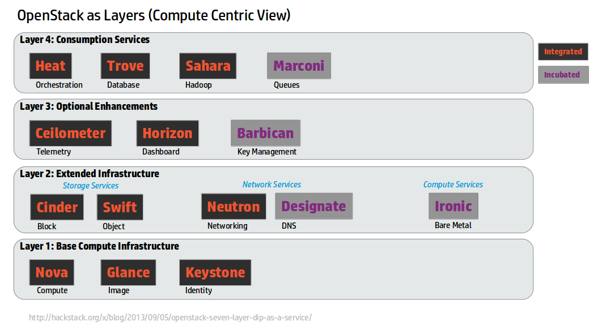

# RDO: Packaging OpenStack for CentOS

## Scale 13, 2015

## Rich Bowen - rbowen@redhat.com

## rdoproject.org

---

## Me

* OpenStack Community Liaison, RDO project

* RDOProject.org

note: This is a fancy way of saying that I try to make the right
connections between OpenStack, RedHat, RDO, and the general Open
Source public.

---

## OpenStack

* Software for creating a private cloud infrastructure.
* OpenStack.org

---

## OpenStack

* Consists of at least 5 components
  * Compute
  * Identity
  * Network
  * Storage
  * Dashboard

---

---

### And 20 or 30 others

---

---

---

### Complicated, and can be difficult to deploy

---

## OpenStack Distros

* OpenStack, like most Open Source projects, releases source code
* Third-party projects produce distributions for installation
  * RDO (Red Hat)
  * DevStack (OpenStack community)
  * Helion (HP)
  * Fuel (Mirantis)
* Most include packages and an installation mechanism

note: DevStack is best suited to test - deploys directly out of a git
branch. 

---

## OpenStack

Attend my Intro to OpenStack on Saturday morning for more detail on OpenStack

---

## RDO

* "RPM Distro of OpenStack"
* Sponsored by Red Hat
* Established April 2013
* Produces packages for CentOS (and other RPM-based distros)
* packstack, puppet scripts to install and configure OpenStack

note: Yes, it's a boring name. Engineers aren't know for being great at
naming things.

---

## RDO

* A community of people who use and support OpenStack on CentOS
* Documentation at http://rdoproject.org/
* Answer questions on http://ask.openstack.org/ both generally about
  OpenStack, and specific to RDO

---

## RDO packaging

* Began in 2013
* Mostly an internal Red Hat effort
* Recently (late 2014) began to open up to more community involvement
* Most of this revolves around CentOS

---

## RDO Quickstart

        sudo yum install -y https://rdo.fedorapeople.org/rdo-release.rpm
        sudo yum install -y openstack-packstack
        packstack --allinone

* Installs OpenStack packages
* Orchestrates the standing up of an OpenStack cluster on one or more
  systems, and gets all the bits talking to one another

---

## Fedora packaging

* Currently using Fedora dist-git

    yum install fedpkg
    fedpkg clone _package_name_

---

* for example ...

        $> fedpkg clone --anonymous openstack-nova
        $> cd openstack-nova
        $ git remote -v
        origin	git://pkgs.fedoraproject.org/openstack-nova (fetch)
        origin	git://pkgs.fedoraproject.org/openstack-nova (push)

* https://fedoraproject.org/wiki/Join_the_package_collection_maintainers for info on gaining non-anonymous access

---

* fedpkg automates building Fedora packages and pushing them to a repo
* .spec file defines how the package(s) will be built

---

## Fedora versioning

* in pace with OpenStack versioning

       Fedora 19 = Grizzly
       Fedora 20 = Havana
       Fedora 21 = Icehouse
       Fedora 22 = Juno

---

## rdopkg

Wrapper around other tools:

* rebases to new version
* Introducing new patches
* Modifying .spec file
* Build packages in copr build system
* Serves as RDO update/CI front end

note: Was internal to Red Hat. Now open source

---

## CentOS

* Community Enterprise OS
* Rebuild of Red Hat Enterprise Linux
* Close relationship with Red Hat

---

## CentOS SIGs

* Special Interest Groups
* People interested in particular technologies, and seeing they work
  well on CentOS
* Produce a repository of packages
* Strive to play nicely with other SIGs

---

## CentOS Cloud SIG

* OpenStack
* Eucalyptus
* OpenNebula
* CloudStack

note: Provides a place where the various cloud infrastructure platforms
can collaborate and ensure that their users have a good experience on
CentOS.

---

## CentOS Cloud SIG

* http://wiki.centos.org/SpecialInterestGroup/Cloud
* Weekly meeting on #centos-devel IRC channel (Freenode) at 15:00 UTC
  Wednesday

---

## Other SIGs

* Cloud Instance SIG
* Storage SIG
* Virtualization SIG
* Atomic SIG

note: The idea is that SIGs will ensure some level of interoperability.
There's also a notion of dependency - the Cloud SIG, for exmaple,
depends on the Virtualization SIG for various libraries.

---

## Community packaging

* Packages Red Hat hasn't gotten to yet
* Perhaps packages that are still in incubation
* Eventually, hopefully, a lot of the work will be done by the community

---

## EL6

"Those who say it's impossible shouldn't interfere with those who are doing it."

---

## EL6

* Juno (and later) require Python 3
* EL6 (ie, CentOS6, RHEL6) only have Python 2
* This is a hard problem
* However, if people want to do this work, we should help and/or stay
  out of their way.

note:

There are a number of people who, for a variety of reasons, want to maintain packages for OpenStack (or at least some portion of OpenStack) on EL6. Some of these are research organizations who have VERY LARGE installations of OpenStack (10k's of nodes) on EL6, and aren't ready to migrate those in a hurry, but want the latest coolness.

---

## Supporting packages

* Storage, eg Ceph
* Networking, eg OPNFV
* Database, eg MySQL

note: Packages and packstack extensions to deploy a complete solution.

---

## RDO CI

* At the moment, this is at https://prod-rdojenkins.rhcloud.com/
* However, we're moving it to ci.centos.org (not live yet)

---

## Delorean

* Delorean builds and maintains yum repositories following openstacks
  uptream repositories.
* When packages break, the maintainer gets an email.
* Should eventually be able to produce RDO packages from Delorean very
  quickly after a release

---

## Next steps

* In Liberty and later, there may be many more projects
* RDO, old model, would need to decide what is in, and what is out
* With a more open, community driven model, we can let people package
  the bits that are of interest to them, and not have to limit
* Context:
  http://www.openstack.org/blog/2015/02/tc-update-project-reform-progress/

note: Viz Thierry's blog post and reorg. Projects can compete. No more
integrated release - projects can release on their own cadence. 

---

## Get involved

* http://rdoproject.org/packaging

---

# Questions?

---

@rdoproject

http://rdoproject.org/

