# An Introduction to OpenStack

## LiuxCon Dublin, 2015

## Rich Bowen - rbowen@redhat.com

---

note: A Foundation, and a software project.

---

## OpenStack, the Foundation

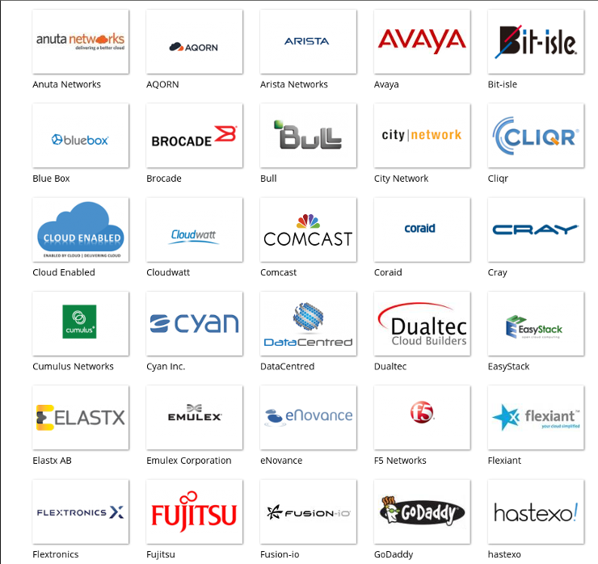

note: Rackspace and NASA solving similar problems, deciding to pool their
resources. Now, a coalition of over 350 companies working together to 
develop the OpenStack software.

Origins: NASA trying to upload multi-terabyte photos for data
processing. Rackspace trying to manage thousands of VMs.

---

* Vendor-neutral governance
* Infrastructure support (especially for testing)
* Community manager services
* User Group and Meetup assistance
* Events (OpenStack Summit)

---

## OpenStack, the Software

OpenStack software controls large pools of compute, storage, and
networking resources throughout a datacenter, managed through a
dashboard or via the OpenStack API.

---

## OpenStack Mission Statement

> To produce the ubiquitous Open Source Cloud Computing platform that will meet the needs of public and private clouds regardless of size, by being simple to implement and massively scalable.

---

## The Big Tent

Projects that are aligned with the OpenStack mission, which are concerned
with interoperability with other OpenStack projects, and which are
willing to submit to the authority of the Technical Committee (TC), are
part of the so-called "Big Tent" of projects that are part of OpenStack.

(More on this later)

---

## Definition of Cloud

* On-demand, self service
* Broad network access
* Resource pooling
* Rapid elasticity
* Measured service

`http://csrc.nist.gov/publications/nistpubs/800-145/SP800-145.pdf`

---

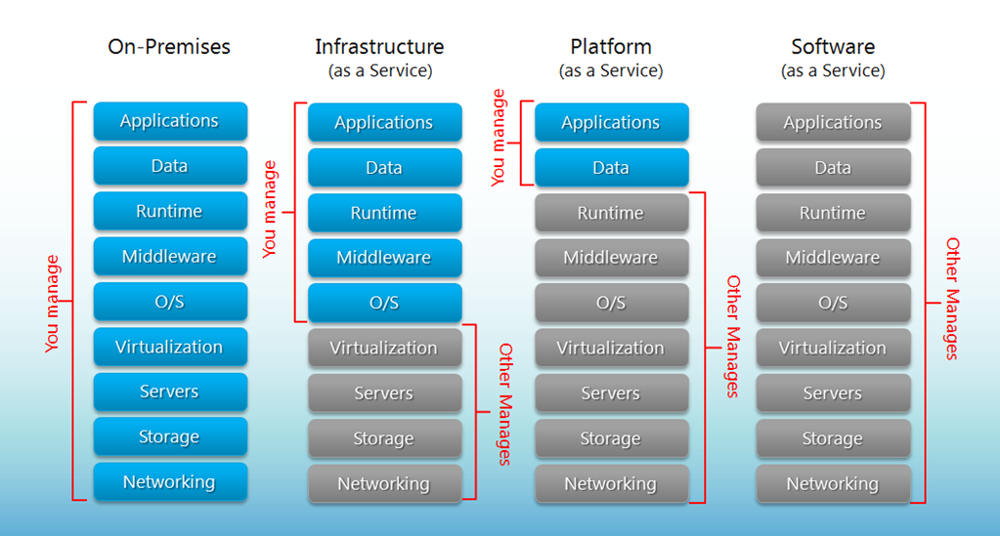

note: OpenStack fits into this iaas slot, and provides you a way to
create your own self-service iaas for your "customers".

---

## Pets

 

* Names like 'fluffy', 'spots', and 'fido'
* When they get sick, you stay up all night recompiling their kernel
* Each one is a unique snowflake

<small>Photo CC julie corsi, Flickr</small>

note: Pets vs Cattle metaphor provides an indication that you might need 
something like this.

---

## Cattle

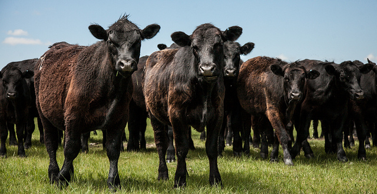

* Names like DC01M049.cloud.ibm.com
* When they get sick you shoot it and spin up a new one
* Each one is identical, or based off of a limited number of templates
* Moo

<small>Photo CC mgbjay, Flickr</small>

---

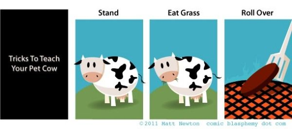

---

## Not necessarily exclusive - you probably have both

---

## Automation

* "Spin up a new one" generally means that it's done in some automated, reproducable manner
* Automation is a key part of the cloud

Note: If not the definition, at least the concept

Heat - see later ...

---

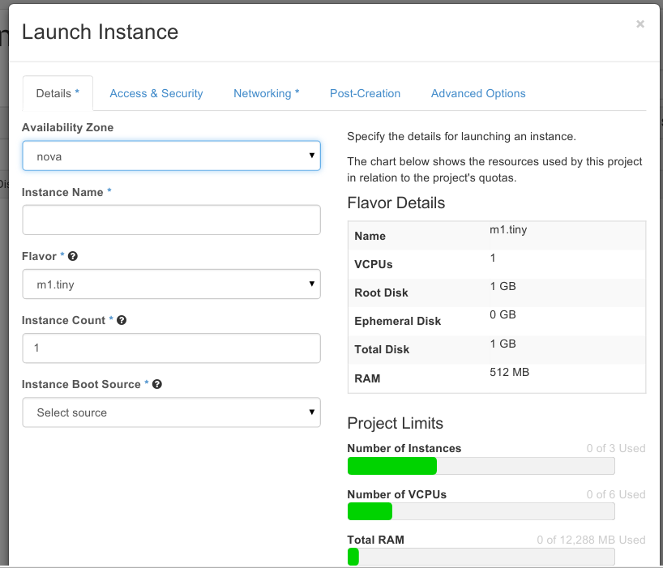

Note: Or ...

---

note: Originally, this is what the OpenStack platform looked like

---

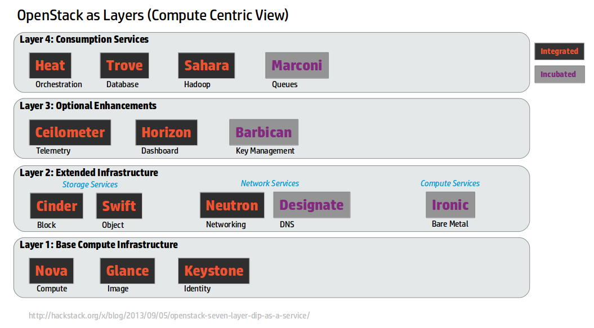

note: It's evolved

---

## Projects

* Bare metal (Ironic)
* Block Storage (Cinder)
* Common Libraries (Oslo)
* Compute (Nova)
* DNS Services (Designate)
* Dashboard (Horizon)
* Data processing service (Sahara)
* Database Service (Trove)
* Deployment (TripleO)
* Documentation (No Clever Name)
* Identity (Keystone)

---

* Image Service (Glance)
* Infrastructure (Infra)
* Key management service (Barbican)
* Message service (Zaqar, formerly Marconi)
* Networking (Neutron)
* Object Storage (Swift)
* Orchestration (Heat)
* Quality Assurance (QA)
* Release cycle management 
* Shared File Systems (Manila)
* Telemetry (Ceilometer)

---

    This presentation doesn't cover all of the projects, so I'm most
    assuredly missing something.

---

## Shared services

* Communicate via REST API amongst themselves
* Optional components
* Pluggable (ie, choose your own back-end)

---

## Identity

* 'Keystone'
* Various identity backends, including LDAP
* Pluggable

---

## Pluggable

* Core design principle
* Many of the projects are light wrappers around your favorite back-end
  service (DNS, File storage, Identity, Database, etc.)

---

## Keystone

* Configure centralized policies across users and systems
* Create users and tenants and define permissions for compute, storage and networking resources using role-based access control (RBAC) features
* Integrate with an existing directory like LDAP, allowing for a single source of identity authentication across the enterprise
* User: Get a list of the services that you can access
* Make API requests or log into the web dashboard to create resources owned by your account

---

## Image Service

* 'Glance'

* Disk and server images.
* Store disk and server images in a variety of back-ends, including OpenStack Object Storage.
* Administrators can create base templates from which their users can start new compute instances
* Users can choose from available images, or create their own from existing servers
* Snapshots can also be stored in the Image Service so that virtual machines can be backed up quickly

---

## Image formats

* Raw
* Machine (kernel/ramdisk outside of image, a.k.a. AMI)
* VHD (Hyper-V)
* VDI (VirtualBox)
* qcow2 (Qemu/KVM)
* VMDK (VMWare)
* OVF (VMWare, others)

---

## Telemetry Service

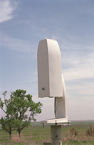

* 'Ceilometer'
* Aggregates usage and performance data across the services deployed in an OpenStack cloud.
* Reporting (billing)
* Alarming (monitoring and notification)

---

## Orchestration Service

* 'Heat'
* Template-driven engine 
* Describe and automate the deployment of infrastructure.

---

## Database Service

* 'Trove'
* Provision and manage multiple database instances as needed.

---

## Compute

* Nova
* This is where your VM runs

---

## Network

* Neutron
* Manages SDN - Software Defined Networking

---

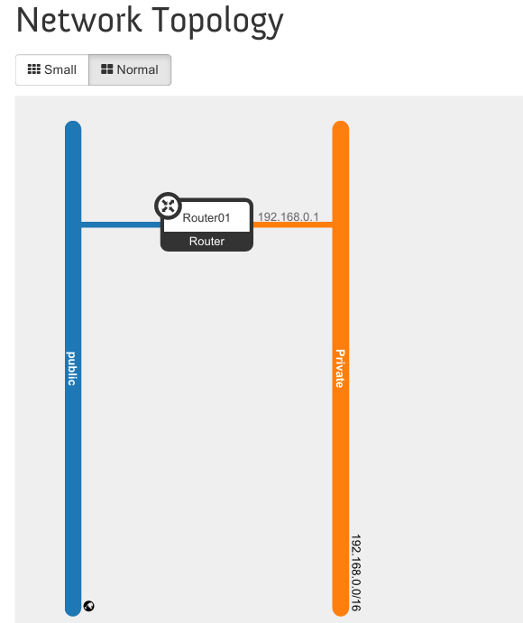

---

## Security

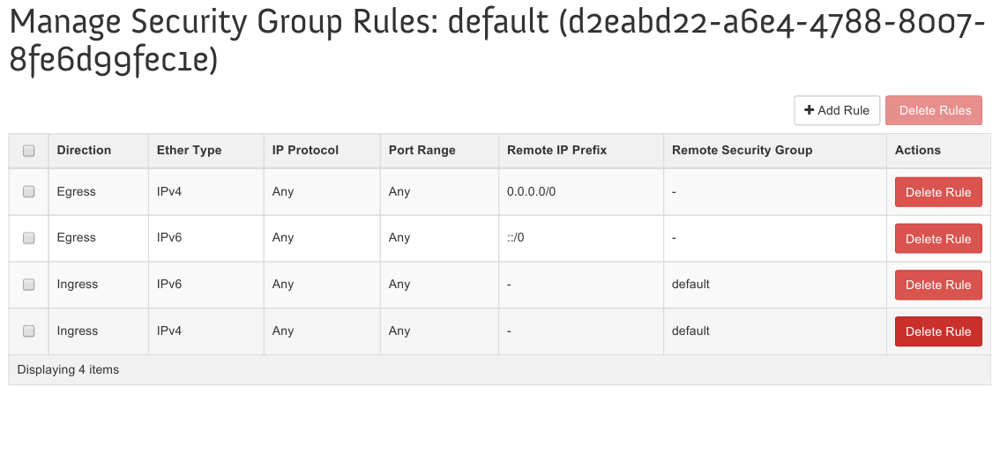

---

## Storage (block storage)

* Cinder
* Traditional disk-based service

---

## Storage (object storage)

* Swift
* API to put/get files or objects, without caring where they actually get stored

---

## Horizon

* The "control panel"
* Communicates with services via the API, since they could be anywhere

---

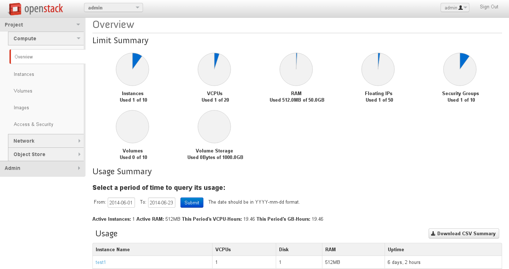

---

## Horizon

* Every OpenStack project must provide an API
* The Horizon team turns that API into a web interface

---

## Glance
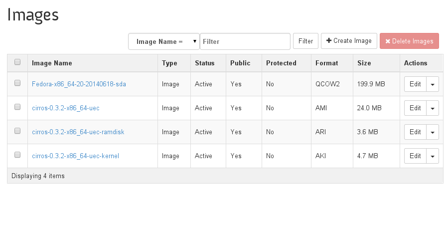

---

## Zaqar

* Message queues
* Handles much of the communication between components

---

## Sahara

    The Sahara project provides a simple means to provision a
    data-intensive application cluster (Hadoop or Spark) on top of
    OpenStack. 

---

## Barbican

    Barbican is a ReST API designed for the secure storage, provisioning
    and management of secrets. It is aimed at being useful for all
    environments, including large ephemeral Clouds. 

---

## Designate

Designate provides DNSaaS services for OpenStack:

* REST API for domain/record management
* Multi-tenant
* Integrated with Keystone for authentication
* Framework in place to integrate with Nova and Neutron notifications (for auto-generated records)
* Support for PowerDNS and Bind9 out of the box

---

## Manila

note: Shared filesystem service for OpenStack. Provides coordinated access
to shared or distributed file systems.

---

## Deployment

* Install/Deploy is complicated
* Every install is different
* There's no single "best" way to do things
* Lots of moving parts

---

## Deployment schemes

* 'All-in-one' - great for testing, impractical in the real world
* Any service can share a machine with others, or run on one, or several machines
* Typical is multiple compute nodes, multiple storage nodes, one "control" note containing Horizon, Neutron, Ceilometer, and so on

---

## Devstack

        git clone https://git.openstack.org/openstack-dev/devstack
        cd devstack
        ./stack.sh

---

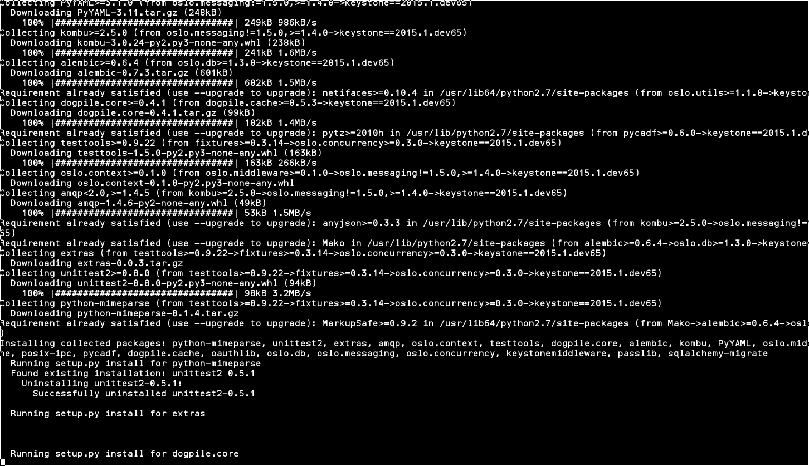

---

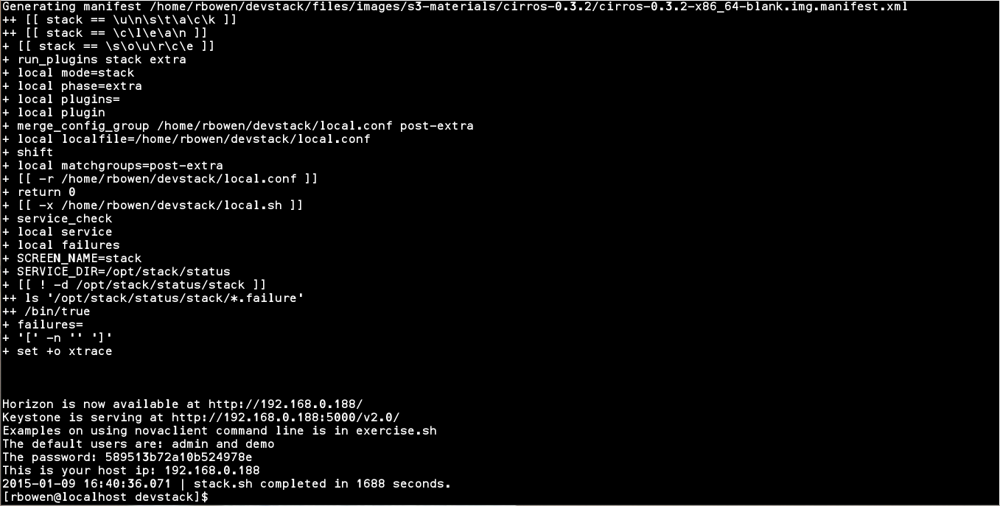

---

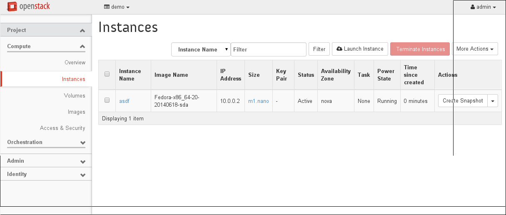

---

## RDO

* http://openstack.redhat.com

        sudo yum install -y http://rdo.fedorapeople.org/rdo-release.rpm
        sudo yum install -y openstack-packstack
        packstack --allinone

note: Day job

---

## RDO

* OpenStack packaged for CentOS, RHEL, and Fedora (and derivatives)
* Red Hat engineers working in the upstream
* Community of developers and users sharing their experience

---

## Alternatives

* Crowbar (Dell)
* Fuel (Mirantis)
* Helion (HP)
* RDO-Manager

note: In no particular order

---

## Why so many?

* This is one place where, for the moment, companies are competing
* Hopefully soon TripleO will be the defacto solution
* Local variants (Debian vs RHEL, for example) will still exist, based
  on TripleO
* We'll start competing on something else, like management
* Speaking of which, http://manageiq.org/

---

## Support

* Lots of companies
* http://ask.openstack.org/

---

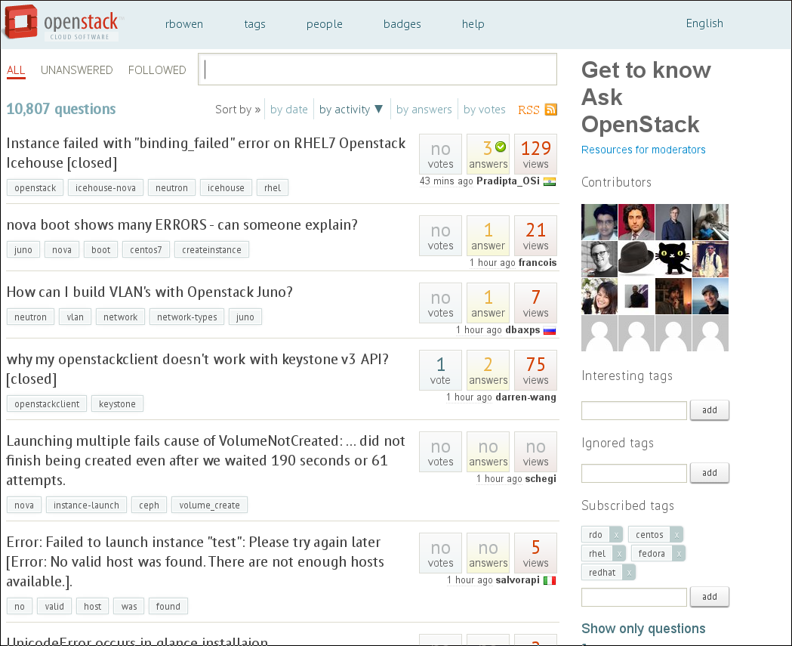

note: StackOverflow-like community for OpenStack.

---

## Testing

* Tempest: The test suite
* Zuul - The upstream testing infrastructure

    http://status.openstack.org/zuul/

---

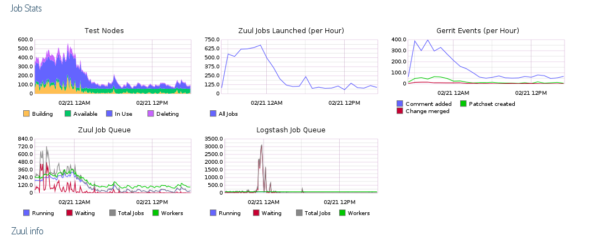

---

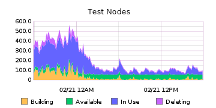

---

## OpenStack Summit

Tokyo, Japan, October 27-30

http://openstack.org/summit

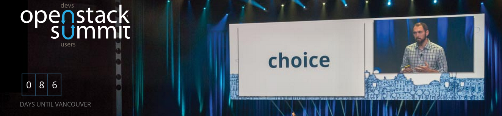

(Next year in Austin, Texas)

---

## Try it out

http://trystack.org/

https://www.youtube.com/watch?v=lj5D94XHb6g

---

# FIN

* Rich Bowen
* RBowen@RedHat.com
* @rbowen
* @RDOCommunity
* **boxofclue.com**/presentations/openstack

