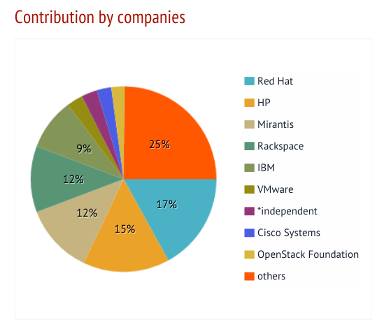
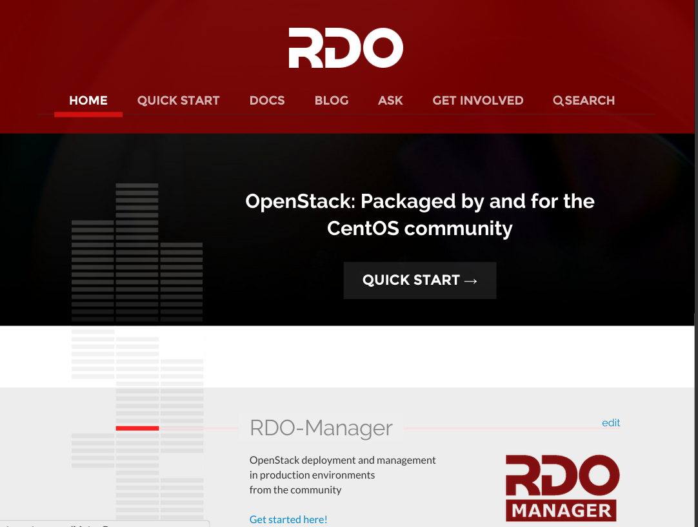
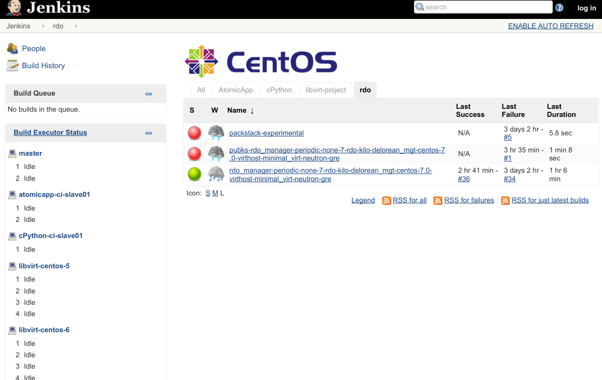
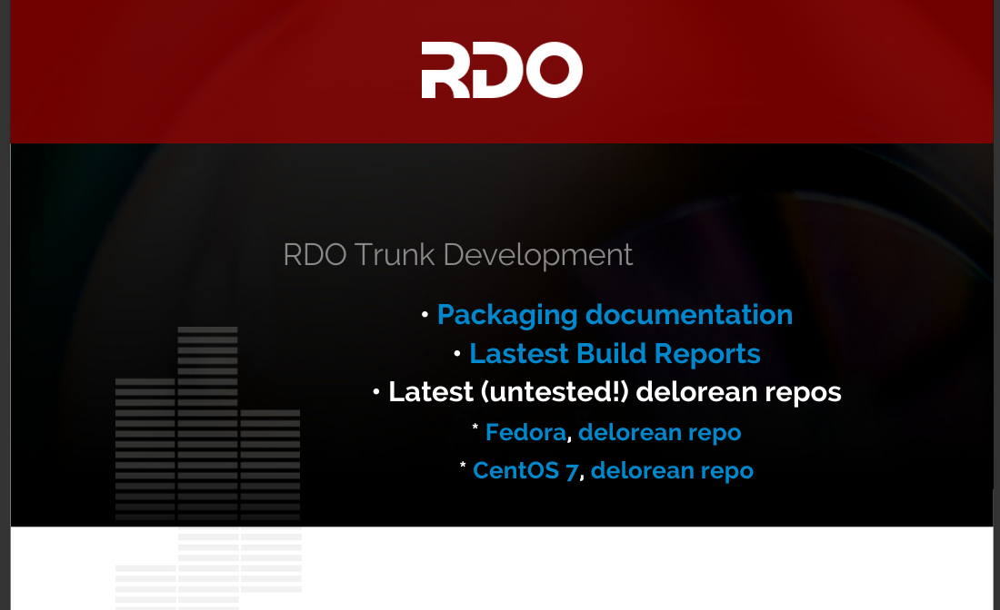

# RDO 

RDO Update

http://rdoproject.org/

---

## What is OpenStack

- Code
- Community
- Foundation
- Infrastructure

note:

- OpenStack is code - a platform for building your own priviate clould

- It's a collection of 30+ semi-independent projects producing various
  pieces of that code, and some agreements around APIs for talking
  between projects.

- It's a Foundation composed of warring tribes banding together for
  mutual benefit. Coopetition. These organizations understand Open Source to
  greater and lesser degrees, and cooperate accordingly.

- Can feel very different from other projects that we're involved with

---

## What is RDO

- OpenStack Distribution
- Packaging for CentOS (and Fedora and RHEL)
- Community of enthusiasts

note:

- Largely a Red Hat project

- Over time, is becoming more of a community project

- 25%, roughly, non-redhat attendance at RDO Meetup in Vancouver

- RDO stands for Rich's Distribution of OpenStack

---

## Why is RDO?

- Ensures that people can run OpenStack on CentOS
- Provides an on-road to RHELOSP
- Establishes Red Hat's reputation as the OpenStack experts
- Is the 'Fedora' to the 'RHEL' of RHELOSP
- Because 'Upstream First'

---

## OpenStack at Red Hat

- Red Hat also participates copiously in OpenStack upstream
- Consistently in top 3 or 4 contributors to OpenStack since we started
  (depending on how you count contributions)
- Several board members, TC members and PTLs, now and historically
- Engineers working on almost every project

---

---

## What RDO provides

- CI
- Repos
- Packages
- Community (IRC, mailing list, website)

---

---

## What is packaged

- OpenStack 'core'
- Big Tent
- What people want to work on
- http://rdoproject.org/packaging/

---

## What else is packaged?

- Ceph?
- OpenShift?
- Not sure, but there's some interest in providing "extra stuff" in the
  packaging, so that it's easy to deploy OpenStack + Foo

---

## Packstack

- Tools for simple deployment
- --allinone for single-node

        sudo yum install -y https://rdoproject.org/repos/rdo-release.rpm
        sudo yum install -y openstack-packstack
        sudo yum install -y openstack-packstack

---

## RDO-Manager

- Doesn't replace packstack, just provides for a more advanced
  deployment
- Called 'RHELOSP Director' in the platform product

note:

- Based on work from eNovance

- We used to have 4 or 5 competing installer efforts. This is the
  resolution of that mess.

---

## RDO CI

- Not a replacement for upstream testing
- Specifically about testing RDO on CentOS, and CentOS on RDO
- Ensure that `yum update` never breaks anything
- RDO/CentOS is the only vendor neutral pure upstream OpenStack
  distribution

---

## RDO CI

- https://ci.centos.org/view/rdo/

---

## Delorean

- Builds RDO packages from upstream changes
- trunk.rdoproject.org

---

## RDO/Juno/EL6

- A (mostly) CERN effort to continue to build Juno packages for EL6
- http://openstack-in-production.blogspot.com/2015/05/juno-el6-and-rdo-community.html

---

## Community

- IRC - #rdo on Freenode
- Mailing lists
    - rdo-list for general discussion
    - rdo-newsletter for monthly updates
- Participation in upstream community
    - ask.openstack.org
- Meetups (occasionally with support from OSAS)
- Social media presence (Twitter, G+, FB) to get the word out

---

## Documentation

- Quickstart and supporting docs
- http://rdoproject.org/ wiki
- (Moving to Middleman soon, to ease pain of contribution)
- Has grown organically for several years, needs major cleanup, pruning

---

## Events

- Event presence at major OpenStack events
    - OpenStack Summit
    - OpenStack Israel
    - OpenStack London
- ... and other related events
    - OSCon
    - LinuxCon
    - ...

---

## Trystack

- Funded by OpenStack Foundation, run by Dan Radez
- Free public cloud
- Try out (limited) OpenStack for a limited time

notes:

- Trystack instances go away after 24 hours

- Resource limited

- Running RDO

---

## What's coming

- OpenStack Israel (June 15)
- RDO at Red Hat Summit
- OpenStack Summit Tokyo
- RDO day at FOSDEM (still tentative)
- OpenStack Summit Austin, Barcelona next year

---

## What's coming upstream

- Elimination of stable point releases, and stable branch
- 'Big Tent' of OpenStack projects

---

# Stay Informed

- [@rdocommunity][]
- [Google+][]
- [planet.openstack.org][]
- [Facebook][]
- [Mailing List][]
- [Newsletter list][]

[@rdocommunity]: http://twitter.com/rdocommunity
[Google+]: https://plus.google.com/communities/110409030763231732154
[planet.openstack.org]: http://planet.openstack.org/
[Facebook]: http://facebook.com/rdocommunity
[Mailing List]: https://www.redhat.com/mailman/listinfo/rdo-list
[Newsletter list]: https://www.redhat.com/mailman/listinfo/rdo-newsletter

